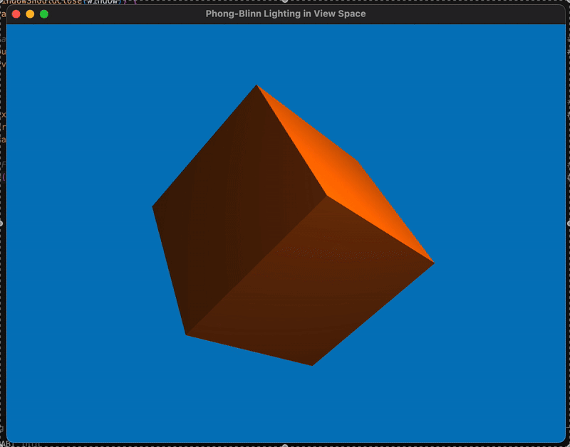

# Phong-Blinn Lighting in View Space



El modelo de iluminación `Phong-Blinn` es una variante del modelo de iluminación `Phong` clásico, usado en gráficos por computadora para simular cómo la luz interactúa con superficies. Es ampliamente utilizado en shaders de iluminación por su buen balance entre realismo y eficiencia computacional.

Posee tres componentes:

* `ambient`: Luz del ambiente que afecta a todo el objeto sin importar su orientación.
* `diffuse`: luz difusa que depende del ángulo de incidencia y la superficie.
* `specular`: A diferencia del modelo `Phong`, el modelo `Phong-Blinn` muestra brillo reflejado por algunas superficies, como superficies pulidas.

Los `shaders` son programas que corren en la GPU y se usan en gráficos por computadora para controlar cómo se dibujan los objetos en pantalla.

## Estructura

- `main.cpp`: Archivo principal del programa 
- `shaders/phong-blinn.vert`: Transforma la posición del un a view space.
- `shaders/phong-blinn.frag`: Aplica los tipos de luz del modelo `Phong-Blinn` al objeto.
- `CMakeLists.txt`: Archivo de configuración del proyecto, utilizado por `CMake` al compilar.

## Problema

Hacer el modelo de iluminación `Phong-Blinn` en espacio de view, en lugar de en espacio de mundo.

## Instrucciones

### Instalación

```bash
brew install cmake
brew install glew
brew install glfw
brew install glm
```

### Compilación

1. Crear un directorio de build:

```bash
mkdir build
cd build
```

2. Generar los archivos de build con CMake:

```bash
cmake ..
```

3. Compilar el proyecto:

```bash
make
```

### Ejecución

Una vez compilado, ejecutar el programa:
```bash
./MyProgram
```
