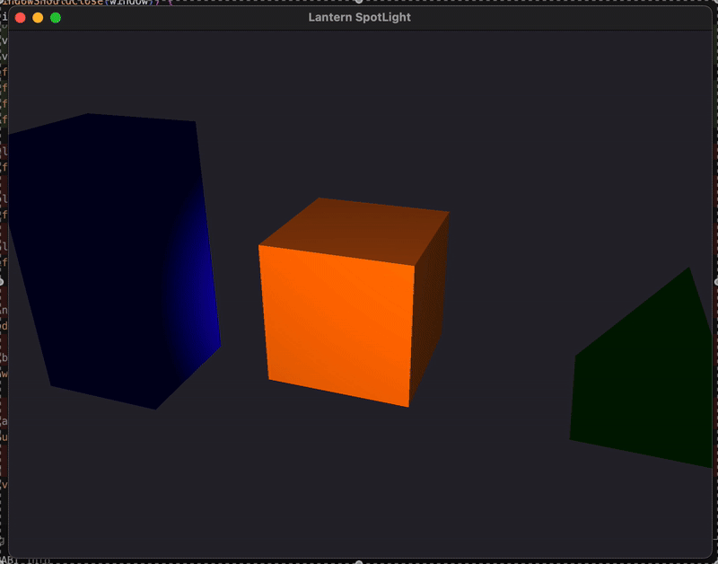

# Lantern SpotLight



Un `FlashLight` es un tipo especial de fuente de luz que se comporta como foco direccional, unida a la cámara y siempre ilumina en la dirección hacia la que el observador está mirando. Este tipo de luz simula el comportamiento de una linterna sostenida por un personaje en primera persona, como suele verse en videojuegos. La luz se emite en forma de un cono, definido por un ángulo de corte interno y externo, que permite suavizar los bordes y crear una caída progresiva de la iluminación en los márgenes del cono.

La posición de la linterna coincide con la posición de la cámara, y su dirección se alinea con el vector forward de la vista. Para implementar este tipo de luz, es necesario calcular tanto la posición como la dirección de la cámara en cada frame y pasarlas al shader. En el fragment shader, se evalúa si un fragmento se encuentra dentro del cono de iluminación, y se atenúa su intensidad dependiendo del ángulo entre la dirección de la linterna y el vector que une la luz con el fragmento.

## Instrucciones

### Instalación

```bash
brew install cmake
brew install glew
brew install glfw
brew install glm
```

### Compilación

1. Crear un directorio de build:

```bash
mkdir build
cd build
```

2. Generar los archivos de build con CMake:

```bash
cmake ..
```

3. Compilar el proyecto:

```bash
make
```

### Ejecución

Una vez compilado, ejecutar el programa:
```bash
./MyProgram
```
