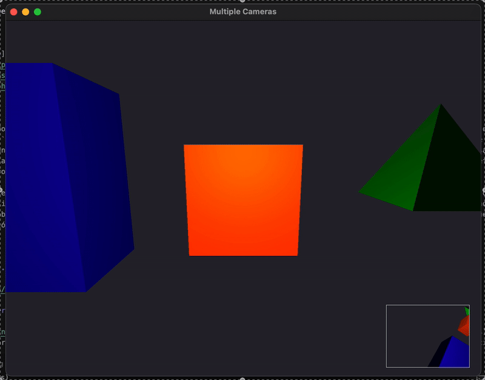

# Frame Buffer Window



TODO

## Estructura

- `main.cpp`: Archivo principal del programa que implementa la escena 3D con múltiples cámaras.
- `shaders/phong-blinn.vert`: Transforma la posición de los vértices al espacio de vista y pasa las normales para el cálculo de iluminación.
- `shaders/phong-blinn.frag`: Aplica el modelo de iluminación Phong-Blinn a los objetos de la escena.
- `shaders/framebuffer.vert`: Shader para el quad que muestra la vista secundaria, transforma las coordenadas de textura.
- `shaders/framebuffer.frag`: Shader que muestra la textura del framebuffer en el quad de la vista secundaria.
- `shaders/border.vert`: Shader para el border blanco del framebuffer.
- `shaders/border.frag`: Shader para colorear el border de color Blanco.
- `CMakeLists.txt`: Archivo de configuración del proyecto, utilizado por CMake al compilar.

## Instrucciones

### Instalación

```bash
brew install cmake
brew install glew
brew install glfw
brew install glm
```

### Compilación

1. Crear un directorio de build:

```bash
mkdir build
cd build
```

2. Generar los archivos de build con CMake:

```bash
cmake ..
```

3. Compilar el proyecto:

```bash
make
```

### Ejecución

Una vez compilado, ejecutar el programa:
```bash
./MyProgram
```
